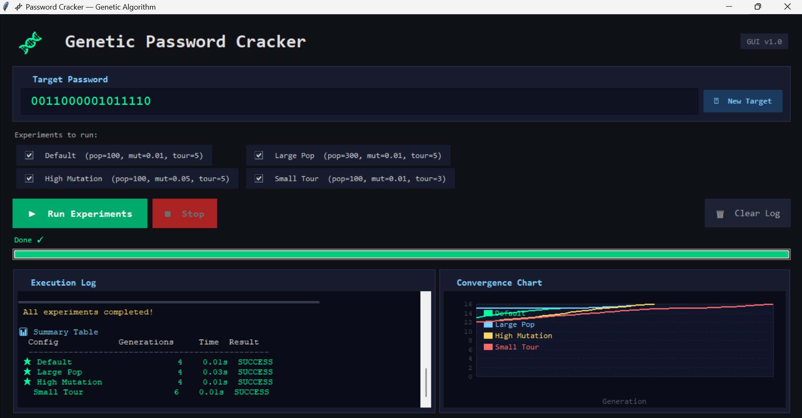

# Project Structure
genetic-password-cracker
│
├── assets
│   └── gui.png
│
├── src
│   ├── genetic_algorithm.py
│   ├── population.py
│   ├── fitness.py
│   └── gui.py
│
├── experiments
│   └── configs.py
│
├── main.py
├── requirements.txt
└── README.md
Installation

Clone the repository:

git clone https://github.com/yourusername
ملف ردمس 

تمام يا Tareq 👌
هذا ملف README.md كامل وجاهز تقدر تنسخه كما هو وتضعه في GitHub.

سأعطيك النسخة النظيفة الصحيحة للـ Markdown 👇

# Genetic Password Cracker (GA)

A Python project that demonstrates how a **Genetic Algorithm (GA)** can be used to simulate password cracking.

The system evolves candidate solutions across generations until the **target password** is discovered.

The project includes a **Graphical User Interface (GUI)** that allows running experiments with different genetic algorithm configurations and visualizing convergence performance.

---

## Screenshot

---

## Features

- Genetic Algorithm implementation from scratch
- Binary password evolution simulation
- Interactive GUI interface
- Convergence visualization
- Multiple experiment configurations
- Performance comparison between GA parameters
- Real-time execution log

---

## Genetic Algorithm Workflow

The algorithm follows these steps:

1. Initialize a **random population** of candidate passwords
2. Evaluate **fitness** by comparing with the target password
3. Select parents using **Tournament Selection**
4. Apply **Crossover** to produce offspring
5. Apply **Mutation** to introduce diversity
6. Generate the next population
7. Repeat until the **target password is found**

---

## Experiment Configurations

| Configuration | Population | Mutation Rate | Tournament Size |
|---------------|------------|--------------|----------------|
| Default | 100 | 0.01 | 5 |
| Large Population | 300 | 0.01 | 5 |
| High Mutation | 100 | 0.05 | 5 |
| Small Tournament | 100 | 0.01 | 3 |

These configurations help analyze how GA parameters affect **convergence speed**.

---

## Technologies Used

- Python
- Genetic Algorithms
- Tkinter (GUI)
- Matplotlib (for convergence visualization)

---

## Project Structure

genetic-password-cracker
│
├── README.md
├── main.py
│
├── assets
│ └── gui.png
│
├── src
│ ├── genetic_algorithm.py
│ ├── population.py
│ ├── fitness.py
│ └── gui.py
│
├── experiments
│ └── configs.py
│
└── requirements.txt

---

## Installation

Clone the repository:

git clone https://github.com/yourusername/genetic-password-cracker.git

Move to the project folder:

cd genetic-password-cracker

Install dependencies:

pip install -r requirements.txt

---

## Run the Project

python main.py

This will launch the **GUI interface** where you can run experiments and visualize results.

---

## Educational Purpose

This project is intended for **educational and research purposes only** to demonstrate:

- Evolutionary Algorithms
- Optimization techniques
- Genetic algorithm convergence

It **does not perform real password hacking**.

---

## Author

**Ayman Jamal**  
Computer Science Student  
Birzeit University
